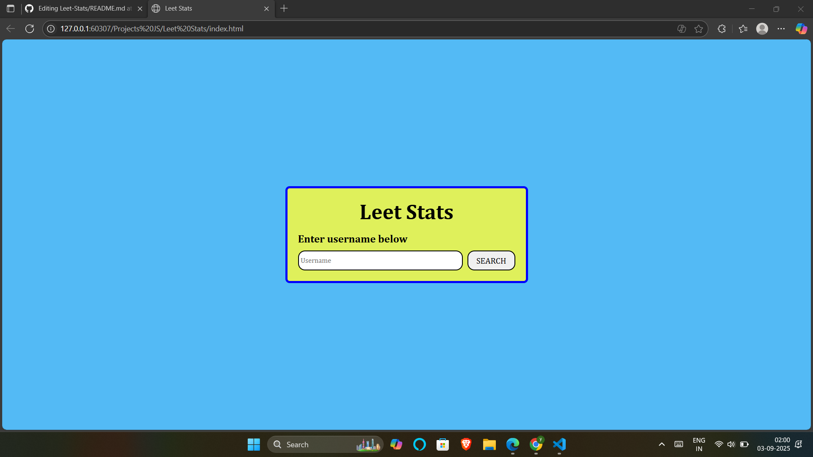
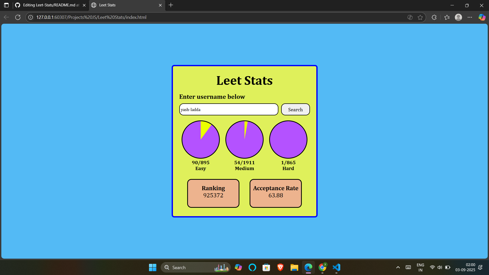

# Leet Stats

A simple web app that fetches and displays **LeetCode user statistics** (solved problems, ranking, acceptance rate) using the [LeetCode Stats API](https://leetcode-stats-api.herokuapp.com/).  

---

## Features
- Enter a LeetCode username to fetch stats  
- Visual progress circles for Easy, Medium, and Hard questions  
- Displays ranking and acceptance rate in styled cards  
- Responsive UI with modern styling  

---

## Technologies Used
- **HTML5** – Structure  
- **CSS3** – Styling & responsive design  
- **JavaScript (Vanilla JS)** – API fetching and DOM updates  
- **LeetCode Stats API** – Data source  

---

## Screenshots

  
  

---

## Future Improvements
- Add more detailed stats (contest ratings, submission history, etc.)  
- Enhance UI with animations and themes  
- Deploy as a live web app  

---

## Author
Developed by **Yash Ladda**
